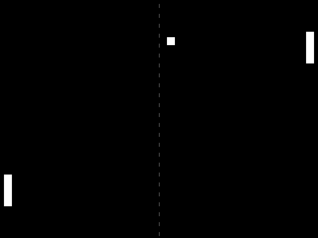

# Memong

This is a little Pong game test working with SDL2, it's not intended to be a full game.

It ain't much but it's honest work.



## Install and run

1. You need to have g++ and [SDL2](https://www.libsdl.org/download-2.0.php) installed

2. Compile the thing
  ```
  make
  ```
3. Run the thing
  ```
  ./memong
  ```